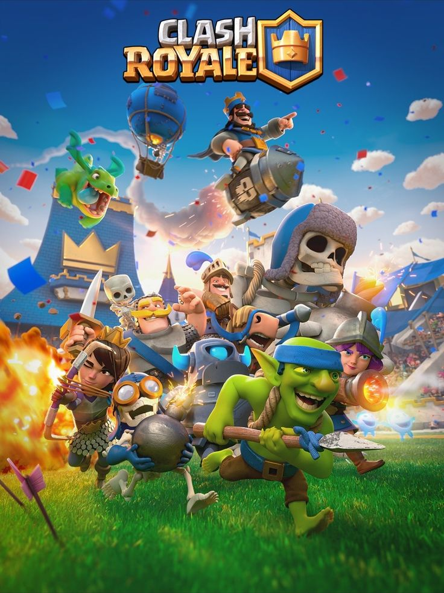

# Clash Royale Insights

# Introduction

Clash Royale is a real-time strategy mobile game developed and published by Supercell. The game was released globally on March 2, 2016. In Clash Royale, players build a deck of cards that they use to battle other players in real-time. The goal of the game is to destroy the opponent's tower.

# Project goals

The goals of this project are to:

* Collect Clash Royale data
* Develop a data platform that allows data to be analyzed in various ways

## Data collection

The data collection process for this project will involve scraping data from the Clash Royale API. The API provides access to a variety of data, including player stats, match results, and card usage. The data will be collected using a Python script.

# Additional resources

* Clash Royale API documentation: [https://developer.clashroyale.com/](https://developer.clashroyale.com/)

# License

This project is licensed under the MIT License.
